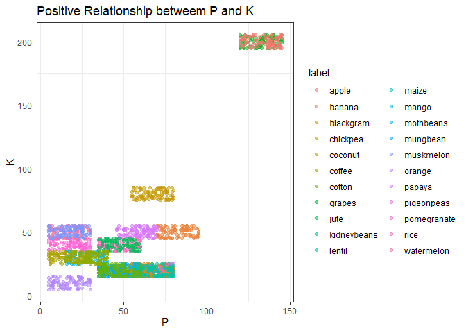
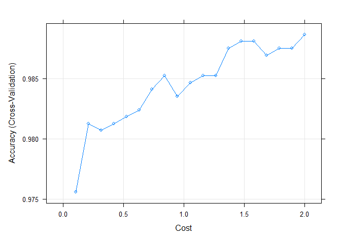
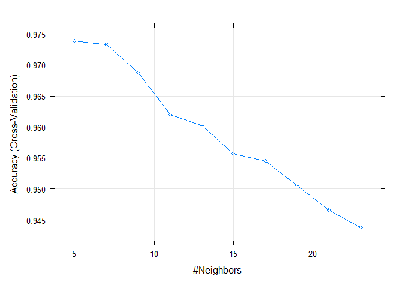
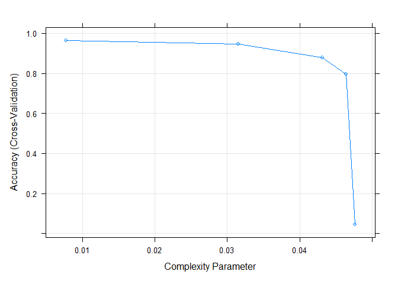
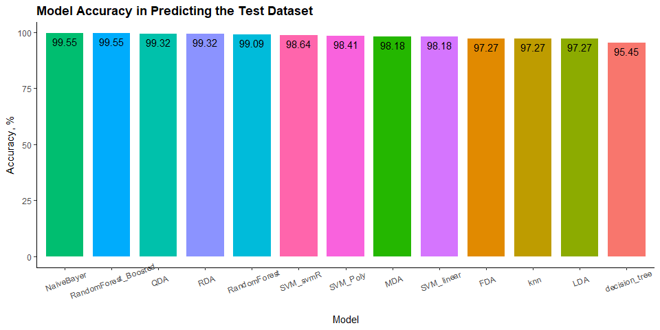
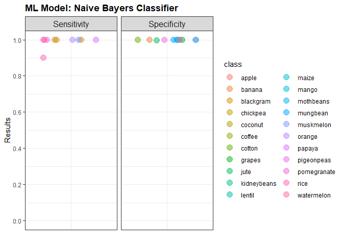

Recommendation of Crop Classes by Predictive Model
================
Kar Ng
2021

-   [1. SUMMARY](#1-summary)
-   [2 R PACKAGES](#2-r-packages)
-   [4 DATA IMPORT AND CLEANING](#4-data-import-and-cleaning)
    -   [4.1 Data import](#41-data-import)
    -   [4.2 Data exploration](#42-data-exploration)
    -   [4.3 Data manipulation](#43-data-manipulation)
-   [5 EXPLORATORY DATA ANALYSIS](#5-exploratory-data-analysis)
    -   [5.1 Histograms](#51-histograms)
    -   [5.2 Correlogram](#52-correlogram)
    -   [5.3 Scatter plot](#53-scatter-plot)
    -   [5.4 Boxplots](#54-boxplots)
-   [6 MODEL BUILDING](#6-model-building)
    -   [6.1 Variables Selection](#61-variables-selection)
    -   [6.2 Train-Test Split](#62-train-test-split)
    -   [6.3 Model](#63-model)
        -   [6.3.1 Discriminant Analysis](#631-discriminant-analysis)
        -   [6.3.2 Naive Bayes Classifier](#632-naive-bayes-classifier)
        -   [6.3.3 Suppor Vector Method
            (SVM)](#633-suppor-vector-method-svm)
        -   [6.3.4 KNN](#634-knn)
        -   [6.3.5 Decision Tree](#635-decision-tree)
        -   [6.3.6 Random Forest](#636-random-forest)
        -   [6.3.7 Gradient Boosted Random
            Forest](#637-gradient-boosted-random-forest)
    -   [6.4 Accuracy Comparison](#64-accuracy-comparison)
    -   [6.5 Confusion Matrix](#65-confusion-matrix)
-   [8 MODEL FOR PRODUCTION](#8-model-for-production)
    -   [8.1 Direct Model Prediction](#81-direct-model-prediction)
    -   [8.2 Functionise the model](#82-functionise-the-model)
    -   [8.3 API App with Plumber](#83-api-app-with-plumber)
-   [9 CONCLUSION](#9-conclusion)
-   [10 CREDIT AND ACKNOWLEDGEMENT](#10-credit-and-acknowledgement)

------------------------------------------------------------------------


------------------------------------------------------------------------

Reading time: 13 minutes

# 1. SUMMARY

This project uses a dataset from *Kaggle.com* that shared publicly with
a machine learning task. This dataset was collected in India. We were
asked to build a predictive model to help farmers to make informed
decision.

We need to build a model that is able to recommend the most suitable
crop to grow in a particular farm based on various parameters specified
in the dataset. These parameters include the levels of nitrogen,
phosphorus, and potassium, as well as temperature, humidity, pH, and
rainfall level. There are 22 agricultural crops recommendable in the
dataset.

Machine learning techniques were applied in this project and 13 models
were built and compared. Naive Bayes classifier and boosted random
forest were the two best models in predicting the test dataset, both at
the same accuracy of 99.55%. Confusion matrix was applied, sensitivity
and specificity were excellent at a level of above 90% in all crop data
points. The model was put into production with development of a API app
to ease application of these models.

*Highlight*


# 2 R PACKAGES

``` r
library(tidyverse)
library(skimr)
library(kableExtra)
library(corrplot)
library(caret)
library(MASS)
library(randomForest)
library(xgboost)
library(rpart)
```

# 4 DATA IMPORT AND CLEANING

This project uses a public dataset in kaggle.com
[Link](https://www.kaggle.com/atharvaingle/crop-recommendation-dataset),
called “Crop Recommendation Dataset” by *Artharva Ingle*.

## 4.1 Data import

``` r
crop <- read.csv("Crop_recom.csv",
                 fileEncoding = "UTF-8-BOM")
```

The dataset has following descriptions, adapted from the *Kaggle*
website.

``` r
Variables <- c("N", "P", "K", "temperature", "humidity", "ph", "rainfall", "label")

Description <- c("N-P-K Ratio of Nitrogen (N) portion in soil",
                 "N-P-K Ratio of Phosphorus (P) portion in soil",
                 "N-P-K Ratio of Potassium (K) portion in soil",
                 "temperature in degree Celsius, oC",
                 "relative humidity in %",
                 "Soil pH value",
                 "rainfall in mm",
                 "Different crops")

data.frame(Variables, Description) %>% 
  kbl() %>% 
  kable_styling(bootstrap_options = c("hover", "stripped", "bordered"))
```

<table class="table table-hover table-bordered" style="margin-left: auto; margin-right: auto;">
<thead>
<tr>
<th style="text-align:left;">
Variables
</th>
<th style="text-align:left;">
Description
</th>
</tr>
</thead>
<tbody>
<tr>
<td style="text-align:left;">
N
</td>
<td style="text-align:left;">
N-P-K Ratio of Nitrogen (N) portion in soil
</td>
</tr>
<tr>
<td style="text-align:left;">
P
</td>
<td style="text-align:left;">
N-P-K Ratio of Phosphorus (P) portion in soil
</td>
</tr>
<tr>
<td style="text-align:left;">
K
</td>
<td style="text-align:left;">
N-P-K Ratio of Potassium (K) portion in soil
</td>
</tr>
<tr>
<td style="text-align:left;">
temperature
</td>
<td style="text-align:left;">
temperature in degree Celsius, oC
</td>
</tr>
<tr>
<td style="text-align:left;">
humidity
</td>
<td style="text-align:left;">
relative humidity in %
</td>
</tr>
<tr>
<td style="text-align:left;">
ph
</td>
<td style="text-align:left;">
Soil pH value
</td>
</tr>
<tr>
<td style="text-align:left;">
rainfall
</td>
<td style="text-align:left;">
rainfall in mm
</td>
</tr>
<tr>
<td style="text-align:left;">
label
</td>
<td style="text-align:left;">
Different crops
</td>
</tr>
</tbody>
</table>

## 4.2 Data exploration

This dataset has 2200 rows of observations and 8 columns of variables.

-   The “label” is categorised as a character variable by R.

-   And the rest are numerical variables.

-   The dataset is clean and having no missing values. It can be assess
    by examining the **complete\_rate** and the associated column
    **n\_missing** that used to detect missing values in the dataset.

``` r
skim_without_charts(crop)
```

<table style="width: auto;" class="table table-condensed">
<caption>
Data summary
</caption>
<thead>
<tr>
<th style="text-align:left;">
</th>
<th style="text-align:left;">
</th>
</tr>
</thead>
<tbody>
<tr>
<td style="text-align:left;">
Name
</td>
<td style="text-align:left;">
crop
</td>
</tr>
<tr>
<td style="text-align:left;">
Number of rows
</td>
<td style="text-align:left;">
2200
</td>
</tr>
<tr>
<td style="text-align:left;">
Number of columns
</td>
<td style="text-align:left;">
8
</td>
</tr>
<tr>
<td style="text-align:left;">
\_\_\_\_\_\_\_\_\_\_\_\_\_\_\_\_\_\_\_\_\_\_\_
</td>
<td style="text-align:left;">
</td>
</tr>
<tr>
<td style="text-align:left;">
Column type frequency:
</td>
<td style="text-align:left;">
</td>
</tr>
<tr>
<td style="text-align:left;">
character
</td>
<td style="text-align:left;">
1
</td>
</tr>
<tr>
<td style="text-align:left;">
numeric
</td>
<td style="text-align:left;">
7
</td>
</tr>
<tr>
<td style="text-align:left;">
\_\_\_\_\_\_\_\_\_\_\_\_\_\_\_\_\_\_\_\_\_\_\_\_
</td>
<td style="text-align:left;">
</td>
</tr>
<tr>
<td style="text-align:left;">
Group variables
</td>
<td style="text-align:left;">
None
</td>
</tr>
</tbody>
</table>

**Variable type: character**

<table>
<thead>
<tr>
<th style="text-align:left;">
skim\_variable
</th>
<th style="text-align:right;">
n\_missing
</th>
<th style="text-align:right;">
complete\_rate
</th>
<th style="text-align:right;">
min
</th>
<th style="text-align:right;">
max
</th>
<th style="text-align:right;">
empty
</th>
<th style="text-align:right;">
n\_unique
</th>
<th style="text-align:right;">
whitespace
</th>
</tr>
</thead>
<tbody>
<tr>
<td style="text-align:left;">
label
</td>
<td style="text-align:right;">
0
</td>
<td style="text-align:right;">
1
</td>
<td style="text-align:right;">
4
</td>
<td style="text-align:right;">
11
</td>
<td style="text-align:right;">
0
</td>
<td style="text-align:right;">
22
</td>
<td style="text-align:right;">
0
</td>
</tr>
</tbody>
</table>

**Variable type: numeric**

<table>
<thead>
<tr>
<th style="text-align:left;">
skim\_variable
</th>
<th style="text-align:right;">
n\_missing
</th>
<th style="text-align:right;">
complete\_rate
</th>
<th style="text-align:right;">
mean
</th>
<th style="text-align:right;">
sd
</th>
<th style="text-align:right;">
p0
</th>
<th style="text-align:right;">
p25
</th>
<th style="text-align:right;">
p50
</th>
<th style="text-align:right;">
p75
</th>
<th style="text-align:right;">
p100
</th>
</tr>
</thead>
<tbody>
<tr>
<td style="text-align:left;">
N
</td>
<td style="text-align:right;">
0
</td>
<td style="text-align:right;">
1
</td>
<td style="text-align:right;">
50.55
</td>
<td style="text-align:right;">
36.92
</td>
<td style="text-align:right;">
0.00
</td>
<td style="text-align:right;">
21.00
</td>
<td style="text-align:right;">
37.00
</td>
<td style="text-align:right;">
84.25
</td>
<td style="text-align:right;">
140.00
</td>
</tr>
<tr>
<td style="text-align:left;">
P
</td>
<td style="text-align:right;">
0
</td>
<td style="text-align:right;">
1
</td>
<td style="text-align:right;">
53.36
</td>
<td style="text-align:right;">
32.99
</td>
<td style="text-align:right;">
5.00
</td>
<td style="text-align:right;">
28.00
</td>
<td style="text-align:right;">
51.00
</td>
<td style="text-align:right;">
68.00
</td>
<td style="text-align:right;">
145.00
</td>
</tr>
<tr>
<td style="text-align:left;">
K
</td>
<td style="text-align:right;">
0
</td>
<td style="text-align:right;">
1
</td>
<td style="text-align:right;">
48.15
</td>
<td style="text-align:right;">
50.65
</td>
<td style="text-align:right;">
5.00
</td>
<td style="text-align:right;">
20.00
</td>
<td style="text-align:right;">
32.00
</td>
<td style="text-align:right;">
49.00
</td>
<td style="text-align:right;">
205.00
</td>
</tr>
<tr>
<td style="text-align:left;">
temperature
</td>
<td style="text-align:right;">
0
</td>
<td style="text-align:right;">
1
</td>
<td style="text-align:right;">
25.62
</td>
<td style="text-align:right;">
5.06
</td>
<td style="text-align:right;">
8.83
</td>
<td style="text-align:right;">
22.77
</td>
<td style="text-align:right;">
25.60
</td>
<td style="text-align:right;">
28.56
</td>
<td style="text-align:right;">
43.68
</td>
</tr>
<tr>
<td style="text-align:left;">
humidity
</td>
<td style="text-align:right;">
0
</td>
<td style="text-align:right;">
1
</td>
<td style="text-align:right;">
71.48
</td>
<td style="text-align:right;">
22.26
</td>
<td style="text-align:right;">
14.26
</td>
<td style="text-align:right;">
60.26
</td>
<td style="text-align:right;">
80.47
</td>
<td style="text-align:right;">
89.95
</td>
<td style="text-align:right;">
99.98
</td>
</tr>
<tr>
<td style="text-align:left;">
ph
</td>
<td style="text-align:right;">
0
</td>
<td style="text-align:right;">
1
</td>
<td style="text-align:right;">
6.47
</td>
<td style="text-align:right;">
0.77
</td>
<td style="text-align:right;">
3.50
</td>
<td style="text-align:right;">
5.97
</td>
<td style="text-align:right;">
6.43
</td>
<td style="text-align:right;">
6.92
</td>
<td style="text-align:right;">
9.94
</td>
</tr>
<tr>
<td style="text-align:left;">
rainfall
</td>
<td style="text-align:right;">
0
</td>
<td style="text-align:right;">
1
</td>
<td style="text-align:right;">
103.46
</td>
<td style="text-align:right;">
54.96
</td>
<td style="text-align:right;">
20.21
</td>
<td style="text-align:right;">
64.55
</td>
<td style="text-align:right;">
94.87
</td>
<td style="text-align:right;">
124.27
</td>
<td style="text-align:right;">
298.56
</td>
</tr>
</tbody>
</table>

Numerical variables are either labelled as “int”, “num”, or “dbl” by R.
The “dbl” stands for “double”, which is usually used to label numbers
with decimal places.

``` r
str(crop)
```

    ## 'data.frame':    2200 obs. of  8 variables:
    ##  $ N          : int  90 85 60 74 78 69 69 94 89 68 ...
    ##  $ P          : int  42 58 55 35 42 37 55 53 54 58 ...
    ##  $ K          : int  43 41 44 40 42 42 38 40 38 38 ...
    ##  $ temperature: num  20.9 21.8 23 26.5 20.1 ...
    ##  $ humidity   : num  82 80.3 82.3 80.2 81.6 ...
    ##  $ ph         : num  6.5 7.04 7.84 6.98 7.63 ...
    ##  $ rainfall   : num  203 227 264 243 263 ...
    ##  $ label      : chr  "rice" "rice" "rice" "rice" ...

## 4.3 Data manipulation

**Convert the variable ‘label’ from character into factor**

It will help to quickly examine what are the levels within the variable
“label” using R function.

``` r
# To protect the original dataset, I create a new object named "crop2" to carry the cleaned data set 

crop2 <- crop %>% 
  mutate(label = as.factor(label))
```

Following result shows that there are 22 crops in this data set. Each
crop has 100 samples, which is excellent as sample sizes are equal and
will make statistical comparison fairer。

``` r
summary(crop2$label)
```

    ##       apple      banana   blackgram    chickpea     coconut      coffee 
    ##         100         100         100         100         100         100 
    ##      cotton      grapes        jute kidneybeans      lentil       maize 
    ##         100         100         100         100         100         100 
    ##       mango   mothbeans    mungbean   muskmelon      orange      papaya 
    ##         100         100         100         100         100         100 
    ##  pigeonpeas pomegranate        rice  watermelon 
    ##         100         100         100         100

**Reduce decimal places**

This step is optional but I will make it happen. I will restrict the
decimal places of “temperature”, “humidity”, “pH”, and “rainfall” to
only one, as this length of decimal places is sufficient in the case of
the project.

``` r
crop2 <- crop2 %>% 
  mutate(temperature = round(temperature, 1),
         humidity = round(humidity, 1),
         ph = round(ph, 1),
         rainfall = round(rainfall, 1))
```

Following summary shows the general statistics of all the variables,
such as minimum, maximum, median, and mean. It also shows the number of
samples if the variables are categorical and is in factor format, such
as the “label” that I converted in the previous section from character
into factor.

``` r
summary(crop2)
```

    ##        N                P                K           temperature   
    ##  Min.   :  0.00   Min.   :  5.00   Min.   :  5.00   Min.   : 8.80  
    ##  1st Qu.: 21.00   1st Qu.: 28.00   1st Qu.: 20.00   1st Qu.:22.80  
    ##  Median : 37.00   Median : 51.00   Median : 32.00   Median :25.60  
    ##  Mean   : 50.55   Mean   : 53.36   Mean   : 48.15   Mean   :25.62  
    ##  3rd Qu.: 84.25   3rd Qu.: 68.00   3rd Qu.: 49.00   3rd Qu.:28.60  
    ##  Max.   :140.00   Max.   :145.00   Max.   :205.00   Max.   :43.70  
    ##                                                                    
    ##     humidity            ph          rainfall            label     
    ##  Min.   : 14.30   Min.   :3.50   Min.   : 20.20   apple    : 100  
    ##  1st Qu.: 60.27   1st Qu.:6.00   1st Qu.: 64.58   banana   : 100  
    ##  Median : 80.50   Median :6.40   Median : 94.90   blackgram: 100  
    ##  Mean   : 71.48   Mean   :6.47   Mean   :103.46   chickpea : 100  
    ##  3rd Qu.: 89.92   3rd Qu.:6.90   3rd Qu.:124.25   coconut  : 100  
    ##  Max.   :100.00   Max.   :9.90   Max.   :298.60   coffee   : 100  
    ##                                                   (Other)  :1600

# 5 EXPLORATORY DATA ANALYSIS

## 5.1 Histograms

It will be interesting to visualise the distribution of each numerical
variables in the data set as an initial visual examination.

``` r
# set up data frame for this section

df4.1 <- crop2 %>% 
  pivot_longer(c(1:7),
               values_to = "result",
               names_to = "variables") %>% 
  mutate(variables = factor(variables, levels = c("N",
                                                     "P",
                                                     "K",
                                                     "temperature",
                                                     "humidity",
                                                     "ph",
                                                     "rainfall"))) 


# plot

ggplot(df4.1, aes(x = result, fill = variables)) +
  geom_histogram(colour = "white") +
  facet_wrap(~variables, scales = "free_x") +
  labs(x = "Variables",
       title = "Distribution of Numerical Variables") +
  theme_bw() +
  theme(legend.position = "none",
        plot.title = element_text(face = "bold")) 
```

    ## `stat_bin()` using `bins = 30`. Pick better value with `binwidth`.

<!-- --> Insights:

-   Distributions of N, P, and K are quite wide spread。

-   The temperatures are mostly between 20 - 30oC。

-   Humidity is quite wide spread with majority fall between 75 - 100%.

-   pH and in soil are most slightly acidic with a value around 6.

-   Rainfalls in this entire dataset are less than 300mm, with majority
    fall between 50 - 120mm.

## 5.2 Correlogram

Following correlogram (a plot for correlation) shows that variables are
independent from each other except the correlation between P and K. here
is a strong relationship between P and K with a correlation of 0.74.

``` r
# convert into matrix, remove the factor "label" 

cor_c <- cor(crop2[, 1:7])

# correlogram

corrplot(cor_c, method = "number", type = "upper")
```

<!-- -->

However, the rule of thumb is that if correlation is greater than 0.8
between two independent variables, then multicollinearity would exist.
Therefore, it is safe to use P and K together during modeling.

## 5.3 Scatter plot

It might be intersting to see how are P and K relate to each other.

``` r
ggplot(crop2, aes(x = P, y = K, colour = label)) +
  geom_point(alpha = 0.5) +
  theme_bw() +
  labs(title = "Positive Relationship betweem P and K") 
```

<!-- --> From the
graph, there might be a positive relationship between K and P, however
the high value of correlation 0.74 is due to the type of crops,
especially the crop types near 150 units of P.

## 5.4 Boxplots

This section uses boxplot to compare the type of crops and other
predictor variables.

``` r
# set up data frame

library(tidytext)


df4.3 <- crop2 %>% 
  pivot_longer(c(1:7),
               values_to = "result",
               names_to = "variables") %>% 
  mutate(variables = factor(variables, levels = c("N",
                                                     "P",
                                                     "K",
                                                     "temperature",
                                                     "humidity",
                                                     "ph",
                                                     "rainfall")),
         label = reorder_within(x = label, by = result, within = variables)) 
  
# plot boxplots

ggplot(df4.3, aes(x = label, y = result, colour = label)) +
  geom_boxplot() +
  facet_wrap(~variables, scale = "free", ncol =1) +
  theme_bw() +
  theme(legend.position = "none",
        axis.text.x = element_text(angle = 90, hjust = 1, vjust = 0.2)) +
  scale_x_reordered()
```

<!-- -->

# 6 MODEL BUILDING

## 6.1 Variables Selection

This section aimed to select relevant and confounding variables for
model building.

According to the purpose of this project, all of these variables are
agricultural-wise important and are critical in determining the type of
crops to grow in a particular farm.

``` r
head(crop2)
```

    ##    N  P  K temperature humidity  ph rainfall label
    ## 1 90 42 43        20.9     82.0 6.5    202.9  rice
    ## 2 85 58 41        21.8     80.3 7.0    226.7  rice
    ## 3 60 55 44        23.0     82.3 7.8    264.0  rice
    ## 4 74 35 40        26.5     80.2 7.0    242.9  rice
    ## 5 78 42 42        20.1     81.6 7.6    262.7  rice
    ## 6 69 37 42        23.1     83.4 7.1    251.1  rice

Therefore, I will keep all variables.

## 6.2 Train-Test Split

The column “label” is what we are going to predict, which is the
types/classes of crops.

``` r
set.seed(123)

# Create Data Partition

training.set <- crop2$label %>% createDataPartition(p = 0.8, list = F)

# split 80% for train set and 20% for test set

train.data <- crop2[training.set, ]

test.data <- crop2[-training.set, ]
```

## 6.3 Model

In this section, I will build and explore the appropriate machine
learning models for farmers to make prediction.

### 6.3.1 Discriminant Analysis

5 methods of Discriminant Analysis are carried out, they are linear,
quadratic, mixture, flexible and regularised discriminant analysis.

``` r
# Create data parameter 

preprocess_parameter <- train.data %>% preProcess(method = c("center", "scale"))

# Data standardisation

train.transformed <- preprocess_parameter %>% predict(train.data)
test.transformed <- preprocess_parameter %>% predict(test.data)

# build discriminant models

model_lda <- lda(label ~., data = train.transformed)
model_qda <- qda(label ~., data = train.transformed)
model_mda <- mda::mda(label ~., data = train.transformed)
model_fda <- mda::fda(label ~., data = train.transformed)
model_rda <- klaR::rda(label ~., data = train.transformed)

# predictions based on test data

predict_lda <- model_lda %>% predict(test.transformed)
predict_qda <- model_qda %>% predict(test.transformed)
predict_mda <- model_mda %>% predict(test.transformed)
predict_fda <- model_fda %>% predict(test.transformed)
predict_rda <- model_rda %>% predict(test.transformed)

# putting the results together

data.frame(
lda_accuracy = mean(predict_lda$class == test.transformed$label),
qda_accuracy = mean(predict_qda$class == test.transformed$label),
mda_accuracy = mean(predict_mda == test.transformed$label),
fda_accuracy = mean(predict_fda == test.transformed$label),
rda_accuracy = mean(predict_rda$class == test.transformed$label)
)
```

    ##   lda_accuracy qda_accuracy mda_accuracy fda_accuracy rda_accuracy
    ## 1    0.9727273    0.9931818    0.9818182    0.9727273    0.9931818

All 5 methods of discriminant models produce great accuracy results.

To be conservative, flexible discriminant analysis (FDA) would be
selected as the best model, if it outcompete other models that I build
later section. It is because FDA does not assume normality of data and
equal variances among classes, and it has also an exellent level of
accuracy at 97%.

QDA is suitable to large data set and RDA is commonly used for large
multivariate dataset (especially when predictor &gt; sample size) with
the present of multicollinearity. The LDA is known for its strict
restriction with assumptions of data normality and equal variances among
classes, whereas MDA is slightly less restrictive model compared to LDA.

### 6.3.2 Naive Bayes Classifier

``` r
model_nb <- train(label ~., data = train.data,
                   method = "nb",
                   trControl = trainControl("cv", number = 10))

# predictions

prediction_nb <- model_nb %>% predict(test.data)

# model accuracy

mean(prediction_nb == test.data$label)
```

    ## [1] 0.9954545

### 6.3.3 Suppor Vector Method (SVM)

This model is sometimes referred as support vector regression (SVR).
This method identify the optimal decision boundary when it separates the
points from different classes and then use the final drawn boundary for
prediction.

I will perform 3 types of SVR here and examine which SVR model produces
the best predictions based on test dataset. The 3 SVR models are linear,
non-linear (Radial Kernal), and non-linear (polynomial kernal).

#### 6.3.3.1 Linear SVM

Applying following codes from caret packages, it helps to determine the
best Cost (C) which is the tuning parameter of SVM. The higher the c,
the better the accuracy result of particular model.

``` r
set.seed(123)

model_svml <- train(label ~., data = train.data,
                    method = "svmLinear",
                    trControl = trainControl("cv", number = 10),
                    tuneGrid = expand.grid(C = seq(0, 2, length = 20)),
                    preProcess = c("center", "scale"))


# predictions

predictions_svml <- model_svml %>% predict(test.data)

# accuracy

mean(predictions_svml == test.data$label)
```

    ## [1] 0.9818182

``` r
plot(model_svml)
```

<!-- -->

``` r
model_svml$bestTune
```

    ##    C
    ## 20 2

#### 6.3.3.2 Non-linear SVM (Radial)

For non-linear SVM, I will use either radial kernal or polynomial
kernal. The R package will find the best values for modelt

``` r
# build the model

set.seed(123)

model_svmR <- train(label ~., data = train.data,
                    method = "svmRadial",
                    trControl = trainControl("cv", number = 10),
                    tuneLength = 10,
                    preProcess = c("center", "scale"))

# predictions

prediction_svmR <- model_svmR %>% predict(test.data)

# accuracy

mean(prediction_svmR == test.data$label)
```

    ## [1] 0.9863636

``` r
model_svmR$bestTune
```

    ##       sigma  C
    ## 8 0.1441001 32

#### 6.3.3.3 Non-linear (Polynomial)

``` r
# build the model

set.seed(123)

# This model takes quite some time to run
model_poly <- train(label ~., data = train.data,
                    method = "svmPoly",
                    trControl = trainControl("cv", number = 10),
                    tuneLength = 4,
                    preProcess = c("center", "scale")
                    )

# predictions 

prediction_poly <- model_poly %>% predict(test.data)

# accuracy

mean(prediction_poly == test.data$label)
```

    ## [1] 0.9840909

### 6.3.4 KNN

Applying the K-Nearest Neighbor in this section. I will use caret
package to help to search for the optimal k number by argument
“tuneLength”.

``` r
set.seed(123)

model_knn <- train(label ~., data = train.data,
                   method = "knn",
                   trControl = trainControl("cv", number = 10),
                   preProcess = c("center", "scale"),
                   tuneLength = 10)

# plot model

plot(model_knn)
```

<!-- -->

K value (Neighbors) has a negative relationship with Accuracy. A k-value
of 5 has the highest accuracy during cross-validation prediction.

``` r
#predictions

prediction_knn <- model_knn %>% predict(test.data)

# accuracy

mean(prediction_knn == test.data$label)
```

    ## [1] 0.9727273

### 6.3.5 Decision Tree

``` r
# packages：rpart
# build the model

set.seed(123)

model_tree <- train(label ~., data = train.data,
                    method = "rpart",
                    trControl = trainControl("cv", number = 10),
                    tuneLength = 5)     
                    # tuneLength to search for the best complexity parameter to prune the tree

plot(model_tree)
```

<!-- -->

Complexity parameter (cp) at lower value produce the highest accuracy. R
recommends a cp of 0.0077 to generate the highest accuracy rate.

``` r
model_tree$bestTune
```

    ##            cp
    ## 1 0.007738095

``` r
par(xpd = NA)
plot(model_tree$finalModel, main = "Decision Tree")
text(model_tree$finalModel, srt = 14, cex = 0.8, col = "blue")
```

<!-- -->

``` r
# predictions

prediction_tree <- model_tree %>% predict(test.data)

# accuracy

mean(prediction_tree == test.data$label)
```

    ## [1] 0.9545455

### 6.3.6 Random Forest

I tune a couple of hyperparameters in the following codes. These tuning
may help to avoid overfitting on noisy data set (P. Bruce and Bruce
2017).

``` r
# build the model

model_rf <- list()
for (nodesize in c(1,2,4,8)){   
  set.seed(123)
  model <- train(label ~., data = train.data,
               method = "rf",
               trControl = trainControl("cv", number = 10),
               metric = "Accuracy",
               nodesize = nodesize)
  model.name <- toString(nodesize)
  model_rf[[model.name]] <- model
}

# Results comparison

resamples(model_rf) %>% summary(metric = "Accuracy")
```

    ## 
    ## Call:
    ## summary.resamples(object = ., metric = "Accuracy")
    ## 
    ## Models: 1, 2, 4, 8 
    ## Number of resamples: 10 
    ## 
    ## Accuracy 
    ##        Min.   1st Qu.    Median      Mean   3rd Qu. Max. NA's
    ## 1 0.9829545 0.9900568 0.9943182 0.9943182 1.0000000    1    0
    ## 2 0.9886364 0.9900568 0.9943182 0.9943182 0.9985795    1    0
    ## 4 0.9886364 0.9900568 0.9943182 0.9948864 1.0000000    1    0
    ## 8 0.9829545 0.9900568 0.9971591 0.9948864 1.0000000    1    0

4 different nodesize (1, 2, 4, 8) produced 99% of accuracy. Nodesize is
the minimum of terminal nodes. The differences in term of accuracy
between nodesize were really small, node 8 has the highest median
accuracy of 99.7% base on cross validations.

I will pick nodesize of 8 to be the most appropriate nodesize for this
random forest model.

Following statistics of the final model of this random forest
computation indicating that:

-   500 trees are trained (default).  
-   The optimal number of variables randomly sampled at each split is 2,
    known as mtry and bootstrap sampling. The optimal value is selected
    by *caret* automation.  
-   OBB rate is extremely small at only 0.51%.

**Variable importance**

Across all of the trees within the random forest algorithm, rainfall,
humidity, and K are the three most important variables.

``` r
Gini.table <- randomForest::importance(model_rf$`8`$finalModel)
Gini.table <- Gini.table %>% as.data.frame()
Gini.table %>% 
  arrange(desc(MeanDecreaseGini))
```

    ##             MeanDecreaseGini
    ## rainfall           366.08567
    ## humidity           354.14878
    ## K                  298.64230
    ## P                  253.62531
    ## N                  174.39842
    ## temperature        119.00671
    ## ph                  82.96643

``` r
varImpPlot(model_rf$`8`$finalModel)
```

<!-- -->

“MeanDecreaseGini” represents the average decrease in node impurity by
the variable. If rainfall and humidity are excluded from the model,
large impurity will occur and affect the prediction accuracy.

``` r
# prediction

prediction_rf <- model_rf %>% predict(test.data)

# accuracy

mean(prediction_rf$`8` == test.data$label)
```

    ## [1] 0.9909091

This tuned random forest model has 99.1% accuracy.

### 6.3.7 Gradient Boosted Random Forest

``` r
model_brf <- train(label ~., data = train.data,
                   method = "xgbTree",
                   trControl = trainControl("cv", number = 10))

# prediction

prediction_brf <- model_brf %>% predict(test.data)

# accuracy

mean(prediction_brf == test.data$label)
```

    ## [1] 0.9954545

## 6.4 Accuracy Comparison

``` r
# df

p.summary <- data.frame(
  LDA = mean(predict_lda$class == test.transformed$label),
  QDA = mean(predict_qda$class == test.transformed$label),
  MDA = mean(predict_mda == test.transformed$label),
  FDA = mean(predict_fda == test.transformed$label),
  RDA = mean(predict_rda$class == test.transformed$label),
  NaiveBayer = mean(prediction_nb == test.data$label),
  SVM_linear = mean(predictions_svml == test.data$label),
  SVM_svmR = mean(prediction_svmR == test.data$label),
  SVM_Poly = mean(prediction_poly == test.data$label),
  knn = mean(prediction_knn == test.data$label),
  decision_tree = mean(prediction_tree == test.data$label),
  RandomForest = mean(prediction_rf$`8` == test.data$label),
  RandomForest_Boosted = mean(prediction_brf == test.data$label)
)

# pivot longer

models_accuracy <- p.summary %>% 
  pivot_longer(c(1:13),
               names_to = "Model",
               values_to = "Accuracy") %>% 
  mutate(Accuracy = round(Accuracy*100, 2)) %>% 
  arrange(desc(Accuracy)) 


# plot

ggplot(models_accuracy, aes(x = reorder(Model, -Accuracy), 
                            y = Accuracy, fill = Model)) +
  geom_bar(stat = "identity", width = 0.8) +
  theme_classic() +
  theme(legend.position = "none",
        plot.title = element_text(face = "bold"),
        axis.text.x = element_text(angle = 20, vjust = 0.85)) +
  geom_text(aes(label = Accuracy), vjust = 1.5) +
  labs(x = "Model",
       y = "Accuracy, %",
       title = "Model Accuracy in Predicting the Test Dataset") 
```

<!-- -->

NaiveBayer is ranked the best model in predicting the type of crops.

## 6.5 Confusion Matrix

Picking the best model, Naive Bayers classifier, to be evaluated in
terms of sensitivity and specificity. This model will be used for
production in the next section if these matrices are good.

*Naive Bayers Classifier*

This model has both sensitivity and specificity above 0.9 for all crops,
which is excellent.

``` r
# Confusion Matrix (predicted classes, observed classes)

nb_cm <- confusionMatrix(prediction_nb, test.data$label)
nb_cm_metrics <- nb_cm$byClass

# cleaning

df6.5 <- nb_cm_metrics %>% 
  data.frame(nb_cm_metrics) %>% 
  mutate(class = row.names(nb_cm_metrics),
         class = str_replace_all(class, "Class: ", " ")) %>% 
  relocate(class, .before = Sensitivity) %>% 
  mutate(class = factor(class))

row.names(df6.5) <- NULL

# manipulation

df6.5 <- df6.5 %>% 
  pivot_longer(c("Sensitivity", "Specificity"),
               names_to = "metrics",
               values_to = "Results")

# plot

ggplot(df6.5, aes(y = Results, x = metrics, colour = class)) +
  geom_jitter(size = 4, alpha = 0.5) +
  scale_y_continuous(lim = c(0, 1), breaks = seq(0, 1, 0.2)) +
  facet_wrap(~metrics, scale = "free_x") +
  theme_bw() +
  theme(plot.title = element_text(face = "bold"),
        strip.text = element_text(size = 12),
        axis.ticks.x = element_blank(),
        axis.text.x = element_blank()) +
  labs(x = " ",
       title = "ML Model: Naive Bayers Classifier")
```

    ## Warning: Removed 22 rows containing missing values (geom_point).

<!-- --> Therefore, in
terms of sensitivity and specificity, this model is considered safe to
be used for production.

# 8 MODEL FOR PRODUCTION

This section will put the best models, **Naive Bayers classifier**, into
production by creating a user API app to aid easy prediction of any
given values.

Suppose that I received two fictional requests from 2 clients in two
different farms, they are both asking what best to crop on their land,
and I have been given their environmental conditions:

``` r
# new data

Variables <- c("N", "P", "K", "temperature", "humidity", "pH", "rainfall")
Client_Jenny <- c(100, 50, 50, 30, 80, 6, 100)
Client_Mike <- c(90, 20, 40, 20, 80, 5, 80)

# df

data.frame(Variables, Client_Jenny, Client_Mike) %>% 
  kbl(align = "c",
      table.attr = "style = 'width:40%;'"
      ) %>% 
  kable_styling(bootstrap_options = c("hover", "stripped", "bordered"))
```

<table style="width:40%; margin-left: auto; margin-right: auto;" class="table table-hover table-bordered">
<thead>
<tr>
<th style="text-align:center;">
Variables
</th>
<th style="text-align:center;">
Client\_Jenny
</th>
<th style="text-align:center;">
Client\_Mike
</th>
</tr>
</thead>
<tbody>
<tr>
<td style="text-align:center;">
N
</td>
<td style="text-align:center;">
100
</td>
<td style="text-align:center;">
90
</td>
</tr>
<tr>
<td style="text-align:center;">
P
</td>
<td style="text-align:center;">
50
</td>
<td style="text-align:center;">
20
</td>
</tr>
<tr>
<td style="text-align:center;">
K
</td>
<td style="text-align:center;">
50
</td>
<td style="text-align:center;">
40
</td>
</tr>
<tr>
<td style="text-align:center;">
temperature
</td>
<td style="text-align:center;">
30
</td>
<td style="text-align:center;">
20
</td>
</tr>
<tr>
<td style="text-align:center;">
humidity
</td>
<td style="text-align:center;">
80
</td>
<td style="text-align:center;">
80
</td>
</tr>
<tr>
<td style="text-align:center;">
pH
</td>
<td style="text-align:center;">
6
</td>
<td style="text-align:center;">
5
</td>
</tr>
<tr>
<td style="text-align:center;">
rainfall
</td>
<td style="text-align:center;">
100
</td>
<td style="text-align:center;">
80
</td>
</tr>
</tbody>
</table>

There are 3 different ways to put this prediction into work.

## 8.1 Direct Model Prediction

It is a wonderful traditional way, though it is a bit tedious. This
method works best for predicting large request (large dataset).

Following codes convert clients request into data frames.

``` r
# convert client data into data frame

Jenny <- data.frame(N = 100, 
                           P = 50,
                           K = 50,
                           temperature = 30,
                           humidity = 80,
                           ph = 6, 
                           rainfall = 100)


Mike <- data.frame(N = 90, 
                          P = 20,
                          K = 40,
                          temperature = 20,
                          humidity = 80,
                          ph = 5, 
                          rainfall = 80)
```

-   Naive Bayes Classifier recommends **Banana** to be the best crop to
    grow for Jenny.

``` r
# Prediction by Naive Bayes Classifier (nb) 

model_nb %>% predict(Jenny)
```

    ## [1] banana
    ## 22 Levels: apple banana blackgram chickpea coconut coffee cotton ... watermelon

-   Naive Bayes Classifier recommends **rice** to be the best crop to
    grow for Mike.

``` r
# Prediction by Naive Bayes Classifier (nb) and Boosted Random Forest (brf)

model_nb %>% predict(Mike) 
```

    ## [1] rice
    ## 22 Levels: apple banana blackgram chickpea coconut coffee cotton ... watermelon

## 8.2 Functionise the model

Alternatively I can build a Naive Bayes Classifier function for this
crop classification project.

``` r
# Create the function of naive bayes

crop_nb <- function(N, P, K, temperature, humidity, ph, rainfall){
  
  to_predict <- data_frame(N = as.numeric(N),
                           P = as.numeric(P),
                           K = as.numeric(K),
                           temperature = as.numeric(temperature),
                           humidity = as.numeric(humidity),
                           ph = as.numeric(ph),
                           rainfall = as.numeric(rainfall))
  
  model_nb %>% predict(to_predict)
  
}
```

-   Making the prediction for Jenny using the *crop\_nb* function.

``` r
Jenny
```

    ##     N  P  K temperature humidity ph rainfall
    ## 1 100 50 50          30       80  6      100

``` r
crop_nb(100, 50, 50, 30, 80, 6, 100)
```

    ## [1] banana
    ## 22 Levels: apple banana blackgram chickpea coconut coffee cotton ... watermelon

-   Making the prediction for Mike using the *crop\_nb* function.

``` r
Mike
```

    ##    N  P  K temperature humidity ph rainfall
    ## 1 90 20 40          20       80  5       80

``` r
crop_nb(90, 20, 40, 20, 80, 5, 80)
```

    ## [1] rice
    ## 22 Levels: apple banana blackgram chickpea coconut coffee cotton ... watermelon

## 8.3 API App with Plumber

This app allows me to freely make crop recommendation for any request
without much coding works. Find the codes of this app in my github repo
with the R file name - **plumber.R**

**Prediction for Jenny**

``` r
Jenny
```

    ##     N  P  K temperature humidity ph rainfall
    ## 1 100 50 50          30       80  6      100


-   Banana is recommended the best crop for Jenny.

**Prediction for Mike**

``` r
Mike
```

    ##    N  P  K temperature humidity ph rainfall
    ## 1 90 20 40          20       80  5       80


-   Rice is recommended the best crop for Mike.

# 9 CONCLUSION

In conclusion, 13 machine learning models were built, trained, and
compared to each other in term of accurcy. The best model was Naive
Bayers classifier in predicting the test dataset with an accuracy level
of 99.55%. Confusion matrix was used to examin the sensitivity and
specificity of this model, and both metrics were at an excellent levels
of above 90%.

This model was then used for recommending the suitable crop to grow for
Jenny and Mike. The Naive Bayes model recommends Banana for Jenny and
Rice for Mike.

# 10 CREDIT AND ACKNOWLEDGEMENT

Specially thanks for *Atharva Ingle* for providing this dataset for
Kaggle users to carry out machine learning analysis. The dataset website
is again at
[Kaggle.com](https://www.kaggle.com/atharvaingle/crop-recommendation-dataset).
