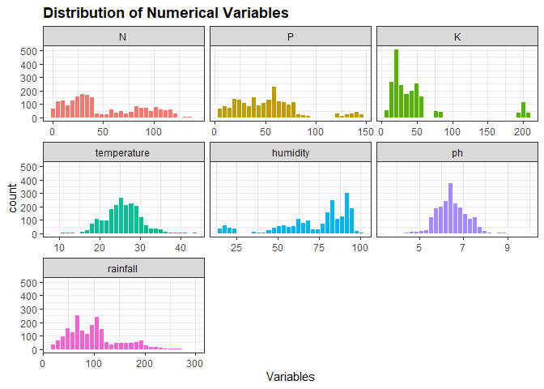

Agriculture Machine Learning (Classification Prediction)
================
Kar
2021

-   [1 R PACKAGES](#1-r-packages)
-   [2 INTRODUCTION](#2-introduction)
-   [3 DATA IMPORT AND CLEANING](#3-data-import-and-cleaning)
    -   [3.1 Data import](#31-data-import)
    -   [3.2 Data exploration](#32-data-exploration)
    -   [3.3 Data manipulation](#33-data-manipulation)
-   [4 Exploratory Data Analysis](#4-exploratory-data-analysis)
    -   [4.1 Histograms](#41-histograms)
    -   [4.2 Correlogram](#42-correlogram)
    -   [4.3 Scatter plot](#43-scatter-plot)
    -   [4.4 Boxplots](#44-boxplots)
-   [5 Model Building](#5-model-building)
    -   [5.1 Variables Selection](#51-variables-selection)
    -   [5.2 Train-Test Split](#52-train-test-split)
    -   [5.3 Model - Discriminant
        Analysis](#53-model---discriminant-analysis)
    -   [5.4 Model - Naive Bayes
        Classifier](#54-model---naive-bayes-classifier)
    -   [5.5 Model - Suppor Vector Method
        (SVM)](#55-model---suppor-vector-method-svm)
        -   [5.5.1 Linear SVM](#551-linear-svm)
        -   [5.5.2 Non-linear SVM (Radial)](#552-non-linear-svm-radial)
        -   [5.5.3 Non-linear (Polynomial)](#553-non-linear-polynomial)
    -   [5.6 Model - KNN](#56-model---knn)
    -   [5.7 Model - Decision Tree](#57-model---decision-tree)
    -   [5.8 Model - Random Forest(s)](#58-model---random-forests)
-   [6 Model for Production](#6-model-for-production)
-   [Conclusion](#conclusion)

# 1 R PACKAGES

``` r
library(tidyverse)
library(skimr)
library(kableExtra)
library(corrplot)
library(caret)
library(MASS)
```

# 2 INTRODUCTION

# 3 DATA IMPORT AND CLEANING

This project uses a public crop dataset in kaggle.com
[Link](https://www.kaggle.com/atharvaingle/crop-recommendation-dataset),
named “Crop Recommendation Dataset” by Artharva Ingle.

## 3.1 Data import

The data set is uploaded into R using following code, and the table
indicates a successful import.

``` r
crop <- read.csv("Crop_recom.csv",
                 fileEncoding = "UTF-8-BOM")
```

The table shows soil nutrients, N, P, and K, as well as temperature,
humidity, pH, rainfall, and label. There are no unit for N, P, and K and
the values are in term of N-P-K ratio in the soil.

The dataset has following descriptions, adapted from the Kaggle website.

``` r
variables <- c("N", "P", "K", "temperature", "humidity", "ph", "rainfall", "label")

description <- c("N-P-K Ratio of Nitrogen (N) portion in soil",
                 "N-P-K Ratio of Phosphorus (P) portion in soil",
                 "N-P-K Ratio of Potassium (K) portion in soil",
                 "temperature in degree Celsius, oC",
                 "relative humidity in %",
                 "Soil pH value",
                 "rainfall in mm",
                 "Different crops")

data.frame(variables, description) %>% 
  kbl() %>% 
  kable_styling(bootstrap_options = c("hover", "stripped", "bordered"))
```

<table class="table table-hover table-bordered" style="margin-left: auto; margin-right: auto;">
<thead>
<tr>
<th style="text-align:left;">
variables
</th>
<th style="text-align:left;">
description
</th>
</tr>
</thead>
<tbody>
<tr>
<td style="text-align:left;">
N
</td>
<td style="text-align:left;">
N-P-K Ratio of Nitrogen (N) portion in soil
</td>
</tr>
<tr>
<td style="text-align:left;">
P
</td>
<td style="text-align:left;">
N-P-K Ratio of Phosphorus (P) portion in soil
</td>
</tr>
<tr>
<td style="text-align:left;">
K
</td>
<td style="text-align:left;">
N-P-K Ratio of Potassium (K) portion in soil
</td>
</tr>
<tr>
<td style="text-align:left;">
temperature
</td>
<td style="text-align:left;">
temperature in degree Celsius, oC
</td>
</tr>
<tr>
<td style="text-align:left;">
humidity
</td>
<td style="text-align:left;">
relative humidity in %
</td>
</tr>
<tr>
<td style="text-align:left;">
ph
</td>
<td style="text-align:left;">
Soil pH value
</td>
</tr>
<tr>
<td style="text-align:left;">
rainfall
</td>
<td style="text-align:left;">
rainfall in mm
</td>
</tr>
<tr>
<td style="text-align:left;">
label
</td>
<td style="text-align:left;">
Different crops
</td>
</tr>
</tbody>
</table>

## 3.2 Data exploration

This data has 2200 rows of observations and 8 columns of variables.

-   The “label” is labelled as a character variable.

-   And the rest are numerical variables.

-   The data set has obviously been cleaned and having no missing values
    that needs to be managed by looking at the **complete\_rate** and
    the associated column **n\_missing** that used to detect missing
    values in the data frame.

``` r
skim_without_charts(crop)
```

<table style="width: auto;" class="table table-condensed">
<caption>
Data summary
</caption>
<thead>
<tr>
<th style="text-align:left;">
</th>
<th style="text-align:left;">
</th>
</tr>
</thead>
<tbody>
<tr>
<td style="text-align:left;">
Name
</td>
<td style="text-align:left;">
crop
</td>
</tr>
<tr>
<td style="text-align:left;">
Number of rows
</td>
<td style="text-align:left;">
2200
</td>
</tr>
<tr>
<td style="text-align:left;">
Number of columns
</td>
<td style="text-align:left;">
8
</td>
</tr>
<tr>
<td style="text-align:left;">
\_\_\_\_\_\_\_\_\_\_\_\_\_\_\_\_\_\_\_\_\_\_\_
</td>
<td style="text-align:left;">
</td>
</tr>
<tr>
<td style="text-align:left;">
Column type frequency:
</td>
<td style="text-align:left;">
</td>
</tr>
<tr>
<td style="text-align:left;">
character
</td>
<td style="text-align:left;">
1
</td>
</tr>
<tr>
<td style="text-align:left;">
numeric
</td>
<td style="text-align:left;">
7
</td>
</tr>
<tr>
<td style="text-align:left;">
\_\_\_\_\_\_\_\_\_\_\_\_\_\_\_\_\_\_\_\_\_\_\_\_
</td>
<td style="text-align:left;">
</td>
</tr>
<tr>
<td style="text-align:left;">
Group variables
</td>
<td style="text-align:left;">
None
</td>
</tr>
</tbody>
</table>

**Variable type: character**

<table>
<thead>
<tr>
<th style="text-align:left;">
skim\_variable
</th>
<th style="text-align:right;">
n\_missing
</th>
<th style="text-align:right;">
complete\_rate
</th>
<th style="text-align:right;">
min
</th>
<th style="text-align:right;">
max
</th>
<th style="text-align:right;">
empty
</th>
<th style="text-align:right;">
n\_unique
</th>
<th style="text-align:right;">
whitespace
</th>
</tr>
</thead>
<tbody>
<tr>
<td style="text-align:left;">
label
</td>
<td style="text-align:right;">
0
</td>
<td style="text-align:right;">
1
</td>
<td style="text-align:right;">
4
</td>
<td style="text-align:right;">
11
</td>
<td style="text-align:right;">
0
</td>
<td style="text-align:right;">
22
</td>
<td style="text-align:right;">
0
</td>
</tr>
</tbody>
</table>

**Variable type: numeric**

<table>
<thead>
<tr>
<th style="text-align:left;">
skim\_variable
</th>
<th style="text-align:right;">
n\_missing
</th>
<th style="text-align:right;">
complete\_rate
</th>
<th style="text-align:right;">
mean
</th>
<th style="text-align:right;">
sd
</th>
<th style="text-align:right;">
p0
</th>
<th style="text-align:right;">
p25
</th>
<th style="text-align:right;">
p50
</th>
<th style="text-align:right;">
p75
</th>
<th style="text-align:right;">
p100
</th>
</tr>
</thead>
<tbody>
<tr>
<td style="text-align:left;">
N
</td>
<td style="text-align:right;">
0
</td>
<td style="text-align:right;">
1
</td>
<td style="text-align:right;">
50.55
</td>
<td style="text-align:right;">
36.92
</td>
<td style="text-align:right;">
0.00
</td>
<td style="text-align:right;">
21.00
</td>
<td style="text-align:right;">
37.00
</td>
<td style="text-align:right;">
84.25
</td>
<td style="text-align:right;">
140.00
</td>
</tr>
<tr>
<td style="text-align:left;">
P
</td>
<td style="text-align:right;">
0
</td>
<td style="text-align:right;">
1
</td>
<td style="text-align:right;">
53.36
</td>
<td style="text-align:right;">
32.99
</td>
<td style="text-align:right;">
5.00
</td>
<td style="text-align:right;">
28.00
</td>
<td style="text-align:right;">
51.00
</td>
<td style="text-align:right;">
68.00
</td>
<td style="text-align:right;">
145.00
</td>
</tr>
<tr>
<td style="text-align:left;">
K
</td>
<td style="text-align:right;">
0
</td>
<td style="text-align:right;">
1
</td>
<td style="text-align:right;">
48.15
</td>
<td style="text-align:right;">
50.65
</td>
<td style="text-align:right;">
5.00
</td>
<td style="text-align:right;">
20.00
</td>
<td style="text-align:right;">
32.00
</td>
<td style="text-align:right;">
49.00
</td>
<td style="text-align:right;">
205.00
</td>
</tr>
<tr>
<td style="text-align:left;">
temperature
</td>
<td style="text-align:right;">
0
</td>
<td style="text-align:right;">
1
</td>
<td style="text-align:right;">
25.62
</td>
<td style="text-align:right;">
5.06
</td>
<td style="text-align:right;">
8.83
</td>
<td style="text-align:right;">
22.77
</td>
<td style="text-align:right;">
25.60
</td>
<td style="text-align:right;">
28.56
</td>
<td style="text-align:right;">
43.68
</td>
</tr>
<tr>
<td style="text-align:left;">
humidity
</td>
<td style="text-align:right;">
0
</td>
<td style="text-align:right;">
1
</td>
<td style="text-align:right;">
71.48
</td>
<td style="text-align:right;">
22.26
</td>
<td style="text-align:right;">
14.26
</td>
<td style="text-align:right;">
60.26
</td>
<td style="text-align:right;">
80.47
</td>
<td style="text-align:right;">
89.95
</td>
<td style="text-align:right;">
99.98
</td>
</tr>
<tr>
<td style="text-align:left;">
ph
</td>
<td style="text-align:right;">
0
</td>
<td style="text-align:right;">
1
</td>
<td style="text-align:right;">
6.47
</td>
<td style="text-align:right;">
0.77
</td>
<td style="text-align:right;">
3.50
</td>
<td style="text-align:right;">
5.97
</td>
<td style="text-align:right;">
6.43
</td>
<td style="text-align:right;">
6.92
</td>
<td style="text-align:right;">
9.94
</td>
</tr>
<tr>
<td style="text-align:left;">
rainfall
</td>
<td style="text-align:right;">
0
</td>
<td style="text-align:right;">
1
</td>
<td style="text-align:right;">
103.46
</td>
<td style="text-align:right;">
54.96
</td>
<td style="text-align:right;">
20.21
</td>
<td style="text-align:right;">
64.55
</td>
<td style="text-align:right;">
94.87
</td>
<td style="text-align:right;">
124.27
</td>
<td style="text-align:right;">
298.56
</td>
</tr>
</tbody>
</table>

Numerical variables either labelled as “int”, “num”, or “dbl” in R,
which the last “dbl” is usually used to labeled floating numbers.

``` r
str(crop)
```

    ## 'data.frame':    2200 obs. of  8 variables:
    ##  $ N          : int  90 85 60 74 78 69 69 94 89 68 ...
    ##  $ P          : int  42 58 55 35 42 37 55 53 54 58 ...
    ##  $ K          : int  43 41 44 40 42 42 38 40 38 38 ...
    ##  $ temperature: num  20.9 21.8 23 26.5 20.1 ...
    ##  $ humidity   : num  82 80.3 82.3 80.2 81.6 ...
    ##  $ ph         : num  6.5 7.04 7.84 6.98 7.63 ...
    ##  $ rainfall   : num  203 227 264 243 263 ...
    ##  $ label      : chr  "rice" "rice" "rice" "rice" ...

## 3.3 Data manipulation

**Convert ”label“ to factor**

To quickly examine what are the levels within the variable “label”,
which is important as it tells the type of crops within this dataset, I
will convert the variable “label” from character into factor. It will
help examination using R functions and later analysis.

``` r
# To protect the original dataset I will hereby create a new object named "crop2" to carry the cleaned data set from this project.

crop2 <- crop %>% 
  mutate(label = as.factor(label))
```

Following result shows that there are 22 crops in this data set. Each
crop has 100 samples, which is excellent as sample sizes are equal and
will make statistical comparison fairer.

``` r
summary(crop2$label)
```

    ##       apple      banana   blackgram    chickpea     coconut      coffee 
    ##         100         100         100         100         100         100 
    ##      cotton      grapes        jute kidneybeans      lentil       maize 
    ##         100         100         100         100         100         100 
    ##       mango   mothbeans    mungbean   muskmelon      orange      papaya 
    ##         100         100         100         100         100         100 
    ##  pigeonpeas pomegranate        rice  watermelon 
    ##         100         100         100         100

**Reduce decimal places**

This step is optional but I decided to make it happened. I will restrict
the decimal places of “temperature”, “humidity”, “pH”, and “rainfall” to
only one, as this length of decimal places is sufficient.

``` r
crop2 <- crop2 %>% 
  mutate(temperature = round(temperature, 1),
         humidity = round(humidity, 1),
         ph = round(ph, 1),
         rainfall = round(rainfall, 1))
```

Following shows statistics of all the columns within the dataset such as
minimum, maximum, median, and mean. It also shows the number of samples
if the column is in factor format, such as the “label” that I have
converted it from character format.

``` r
summary(crop2)
```

    ##        N                P                K           temperature   
    ##  Min.   :  0.00   Min.   :  5.00   Min.   :  5.00   Min.   : 8.80  
    ##  1st Qu.: 21.00   1st Qu.: 28.00   1st Qu.: 20.00   1st Qu.:22.80  
    ##  Median : 37.00   Median : 51.00   Median : 32.00   Median :25.60  
    ##  Mean   : 50.55   Mean   : 53.36   Mean   : 48.15   Mean   :25.62  
    ##  3rd Qu.: 84.25   3rd Qu.: 68.00   3rd Qu.: 49.00   3rd Qu.:28.60  
    ##  Max.   :140.00   Max.   :145.00   Max.   :205.00   Max.   :43.70  
    ##                                                                    
    ##     humidity            ph          rainfall            label     
    ##  Min.   : 14.30   Min.   :3.50   Min.   : 20.20   apple    : 100  
    ##  1st Qu.: 60.27   1st Qu.:6.00   1st Qu.: 64.58   banana   : 100  
    ##  Median : 80.50   Median :6.40   Median : 94.90   blackgram: 100  
    ##  Mean   : 71.48   Mean   :6.47   Mean   :103.46   chickpea : 100  
    ##  3rd Qu.: 89.92   3rd Qu.:6.90   3rd Qu.:124.25   coconut  : 100  
    ##  Max.   :100.00   Max.   :9.90   Max.   :298.60   coffee   : 100  
    ##                                                   (Other)  :1600

# 4 Exploratory Data Analysis

## 4.1 Histograms

It will be interesting to visualise the distribution of each numerical
variables in the data set as a initial examination.

``` r
# set up data frame for this section

df4.1 <- crop2 %>% 
  pivot_longer(c(1:7),
               values_to = "result",
               names_to = "variables") %>% 
  mutate(variables = factor(variables, levels = c("N",
                                                     "P",
                                                     "K",
                                                     "temperature",
                                                     "humidity",
                                                     "ph",
                                                     "rainfall"))) 


# plot

ggplot(df4.1, aes(x = result, fill = variables)) +
  geom_histogram(colour = "white") +
  facet_wrap(~variables, scales = "free_x") +
  labs(x = "Variables",
       title = "Distribution of Numerical Variables") +
  theme_bw() +
  theme(legend.position = "none",
        plot.title = element_text(face = "bold")) 
```

    ## `stat_bin()` using `bins = 30`. Pick better value with `binwidth`.

<!-- --> Insights:

-   Distributions of N, P, and K are quite wide spread which might be
    due to the presence of different soil types contributing to this
    dataset. It indicating that they can be counding variables in this
    dataset.

-   The majority of temperatures are spread between 20 - 30oC in this
    dataset.

-   Humidity is quite wide spread with majority fall between 75 - 100%.

-   pH and in soil are most slightly acidic with a value around 6.

-   Rainfalls in this entire dataset are less than 300mm, with majority
    fall between 50 - 120mm.

## 4.2 Correlogram

Following correlogram (a plot for correlation) shows that variables are
independent from each other except P and K.

There is a strong relationship between P and K with a correlation of
0.74. It might be an issue during model building however VIF will be
checked again in that section to avoid multicollinearity. Though a
correlation less than 0.8 between two variables should be indicating
that multicollinearity might not exist, but VIF will be computed.

``` r
# convert into matrix, remove the factor "label" 

cor_c <- cor(crop2[, 1:7])

# correlogram

corrplot(cor_c, method = "number", type = "upper")
```

<!-- -->

## 4.3 Scatter plot

Plotting the relationship between P and K.

``` r
ggplot(crop2, aes(x = P, y = K, colour = label)) +
  geom_point(alpha = 0.5) +
  theme_bw() +
  labs(title = "Positive Relationship betweem P and K") 
```

<!-- --> From the
graph, there might be a positive relationship between K and P, however
the high value of correlation 0.74 might be due to the type to crops and
especially the crop groups near 150.

## 4.4 Boxplots

This section uses boxplot to simultaneously compare the 7 numerical
variables among different crops stored within the vector, “label”.
Recall, the 7 numerical variables are:

``` r
names(crop2[1:7])
```

    ## [1] "N"           "P"           "K"           "temperature" "humidity"   
    ## [6] "ph"          "rainfall"

``` r
# set up data frame

df4.3 <- crop2 %>% 
  pivot_longer(c(1:7),
               values_to = "result",
               names_to = "variables") %>% 
  mutate(variables = factor(variables, levels = c("N",
                                                     "P",
                                                     "K",
                                                     "temperature",
                                                     "humidity",
                                                     "ph",
                                                     "rainfall"))) 

# plot boxplots

ggplot(df4.3, aes(x = label, y = result, colour = label)) +
  geom_boxplot() +
  facet_wrap(~variables, scale = "free", ncol =1) +
  theme_bw() +
  theme(legend.position = "none",
        axis.text.x = element_text(angle = 90, hjust = 1, vjust = 0.2))
```

<!-- -->

# 5 Model Building

The purpose of modeling of this project is to build an effective
predictive model to suggest the most appropriate crops to grow in a
particular farm based on various parameter.

## 5.1 Variables Selection

This section aims to select relevant and confounding variables during
model building. According to the purpose of this project all of these
variables are agricultural-wise important and relevant in determining
the type of crops to grow in a particular farm.

``` r
head(crop2)
```

    ##    N  P  K temperature humidity  ph rainfall label
    ## 1 90 42 43        20.9     82.0 6.5    202.9  rice
    ## 2 85 58 41        21.8     80.3 7.0    226.7  rice
    ## 3 60 55 44        23.0     82.3 7.8    264.0  rice
    ## 4 74 35 40        26.5     80.2 7.0    242.9  rice
    ## 5 78 42 42        20.1     81.6 7.6    262.7  rice
    ## 6 69 37 42        23.1     83.4 7.1    251.1  rice

Therefore, I will keep all of these variables.

## 5.2 Train-Test Split

The column “label” is what we are going to predict. It is a
classification problem.

``` r
set.seed(123)

# Create Data Partition

training.set <- crop2$label %>% createDataPartition(p = 0.8, list = F)

# split 80% for train set and 20% for test set

train.data <- crop2[training.set, ]

test.data <- crop2[-training.set, ]
```

## 5.3 Model - Discriminant Analysis

5 methods of Discriminant Analysis are carried out, they are linear,
quadratic, mixture, flexible and regularised discriminant analysis.

``` r
# Create data parameter 

preprocess_parameter <- train.data %>% preProcess(method = c("center", "scale"))

# Data standardisation

train.transformed <- preprocess_parameter %>% predict(train.data)
test.transformed <- preprocess_parameter %>% predict(test.data)
```

``` r
# build lda model
model_lda <- lda(label ~., data = train.transformed)
model_qda <- qda(label ~., data = train.transformed)
model_mda <- mda::mda(label ~., data = train.transformed)
model_fda <- mda::fda(label ~., data = train.transformed)
model_rda <- klaR::rda(label ~., data = train.transformed)
```

``` r
predict_lda <- model_lda %>% predict(test.transformed)
predict_qda <- model_qda %>% predict(test.transformed)
predict_mda <- model_mda %>% predict(test.transformed)
predict_fda <- model_fda %>% predict(test.transformed)
predict_rda <- model_rda %>% predict(test.transformed)
```

``` r
data.frame(
lda_accuracy = mean(predict_lda$class == test.transformed$label),
qda_accuracy = mean(predict_qda$class == test.transformed$label),
mda_accuracy = mean(predict_mda == test.transformed$label),
fda_accuracy = mean(predict_fda == test.transformed$label),
rda_accuracy = mean(predict_rda$class == test.transformed$label)
)
```

    ##   lda_accuracy qda_accuracy mda_accuracy fda_accuracy rda_accuracy
    ## 1    0.9727273    0.9931818    0.9818182    0.9727273    0.9931818

All 5 methods of discriminant models produce great accuracy results.

To be conservative, flexible discriminant analysis (fda) would be
selected as the best model as it do not assume normality of data and
equal variances among classes, and it has an accuracy of 97%.

QDA suitable to large data set and RDA is commonly used for large
multivariate dataset with the present of multicollinearity. The LDA is
known for its restriction with assumptions in the normality of data and
equal variance among classes, whereas MDA is slightly less restrictive
model compared to LDA.

## 5.4 Model - Naive Bayes Classifier

``` r
# build the model

model_nb <- klaR::NaiveBayes(label ~., data = train.data)

# predictions

prediction_nb <- model_nb %>% predict(test.data) 

# model accuracy

mean(prediction_nb$class == test.data$label)
```

    ## [1] 0.9954545

``` r
model_nbc <- train(label ~., data = train.data,
                   method = "nb",
                   trControl = trainControl("cv", number = 10))

# predictions

prediction_nbc <- model_nbc %>% predict(test.data)

# model accuracy

mean(prediction_nbc == test.data$label)
```

    ## [1] 0.9954545

## 5.5 Model - Suppor Vector Method (SVM)

This model is sometimes referred as support vector regression (SVR).
This method identify the optimal decision boundary when it seperates the
points from different classe and then use the final drawn boundary for
prediction.

I will perform 3 types of SVR here and examine which SVR model produces
the best predictions based on test data set. The 3 SVR models are
linear, non-linear (Radial Kernal), and non-linear (polynomial kernal).

### 5.5.1 Linear SVM

Applying following codes from caret packages, it helps to determine the
best Cost (C) which is the tuning parameter of SVM. The higher the c,
the better the accuracy result of particular model.

``` r
set.seed(123)

model_svml <- train(label ~., data = train.data,
                    method = "svmLinear",
                    trControl = trainControl("cv", number = 10),
                    tuneGrid = expand.grid(C = seq(0, 2, length = 20)),
                    preProcess = c("center", "scale"))


# predictions

predictions_svml <- model_svml %>% predict(test.data)

# accuracy

mean(predictions_svml == test.data$label)
```

    ## [1] 0.9818182

``` r
plot(model_svml)
```

<!-- -->

``` r
model_svml$bestTune
```

    ##    C
    ## 20 2

### 5.5.2 Non-linear SVM (Radial)

For non-linear SVM, I will use either radial kernal or polynomial
kernal. The R package will find the best values for modelt

``` r
# build the model

set.seed(123)

model_svmR <- train(label ~., data = train.data,
                    method = "svmRadial",
                    trControl = trainControl("cv", number = 10),
                    tuneLength = 10,
                    preProcess = c("center", "scale"))

# predictions

prediction_svmR <- model_svmR %>% predict(test.data)

# accuracy

mean(prediction_svmR == test.data$label)
```

    ## [1] 0.9863636

``` r
model_svmR$bestTune
```

    ##       sigma  C
    ## 8 0.1441001 32

### 5.5.3 Non-linear (Polynomial)

``` r
# build the model

set.seed(123)

# This model takes quite some time to run
model_poly <- train(label ~., data = train.data,
                    method = "svmPoly",
                    trControl = trainControl("cv", number = 10),
                    tuneLength = 4,
                    preProcess = c("center", "scale")
                    )

# predictions 

prediction_poly <- model_poly %>% predict(test.data)

# accuracy

mean(prediction_poly == test.data$label)
```

    ## [1] 0.9840909

-   Random forest (so we have a tree-based model to compare to our LM)
    -   Can use gradient boosted tree
    -   Support vector regression (classification)
-   tune models GridsearchCV
-   test ensembles

## 5.6 Model - KNN

Applying the K-Nearest Neighbor with caret package that help to search
for the optimal k number by argument tuneLength.

``` r
set.seed(123)

model_knn <- train(label ~., data = train.data,
                   method = "knn",
                   trControl = trainControl("cv", number = 10),
                   preProcess = c("center", "scale"),
                   tuneLength = 10)

# plot model

plot(model_knn)
```

<!-- -->

K value (Neighbors) has a negative relationship with Accuracy. A k-value
of 5 is seems to have the highest accuracy.

``` r
#predictions

prediction_knn <- model_knn %>% predict(test.data)

# accuracy

mean(prediction_knn == test.data$label)
```

    ## [1] 0.9727273

## 5.7 Model - Decision Tree

``` r
# packages

library(rpart)

# build the model

set.seed(123)

model_tree <- train(label ~., data = train.data,
                    method = "rpart",
                    trControl = trainControl("cv", number = 10),
                    tuneLength = 5)     
                    # tuneLength to search for the best complexity parameter to prune the tree

plot(model_tree)
```

<!-- -->

Complexity parameter (cp) at lower value produce the highest accuracy. R
recommending a best cp of 0.0077 to have the highest accuracy rate.

``` r
model_tree$bestTune
```

    ##            cp
    ## 1 0.007738095

``` r
par(xpd = NA)
plot(model_tree$finalModel, main = "Decision Tree")
text(model_tree$finalModel, srt = 14, cex = 0.8, col = "blue")
```

<!-- -->

``` r
# predictions

prediction_tree <- model_tree %>% predict(test.data)

# accuracy

mean(prediction_tree == test.data$label)
```

    ## [1] 0.9545455

## 5.8 Model - Random Forest(s)

In previous decision tree which I grown a tree, and now I grown a
forest. It means that I build multiple trees from the data set to
achieve a better predictive performance.

``` r
# build the model

set.seed(123)

model_rf <- train(label ~., data = train.data,
               method = "rf",
               trControl = trainControl("cv", number = 10))

# predictions

prediction_rf <- model_rf %>% predict(test.data)

# accuracy

mean(prediction_rf == test.data$label)
```

    ## [1] 0.9931818

Model with 2 mtry (optimal number) of predictors randomly selected and
sampled at each split has the highest accuracy rate. It is selected and
suggested by R and will be used as the mtry of the final random forest
model.

I tune a couple of hyperparameters in the following code. These tuning
may help to avoid overfitting on noisy data set (P. Bruce and Bruce
2017). This step is optional as the previous rainforest algorithm has a
99.3% accuracy.

``` r
# build the model

model_rf2 <- list()
for (nodesize in c(1,2,4,8)){   
  set.seed(123)
  model <- train(label ~., data = train.data,
               method = "rf",
               trControl = trainControl("cv", number = 10),
               metric = "Accuracy",
               nodesize = nodesize)
  model.name <- toString(nodesize)
  model_rf2[[model.name]] <- model
}

# compare results

resamples(model_rf2) %>% summary(metric = "Accuracy")
```

    ## 
    ## Call:
    ## summary.resamples(object = ., metric = "Accuracy")
    ## 
    ## Models: 1, 2, 4, 8 
    ## Number of resamples: 10 
    ## 
    ## Accuracy 
    ##        Min.   1st Qu.    Median      Mean   3rd Qu. Max. NA's
    ## 1 0.9829545 0.9900568 0.9943182 0.9943182 1.0000000    1    0
    ## 2 0.9886364 0.9900568 0.9943182 0.9943182 0.9985795    1    0
    ## 4 0.9886364 0.9900568 0.9943182 0.9948864 1.0000000    1    0
    ## 8 0.9829545 0.9900568 0.9971591 0.9948864 1.0000000    1    0

4 different nodesize (1, 2, 4, 8) produced a 99% of accuracy. Though
there are minor differences, node 8 has the highest median accuracy of
99.7% base on cross validations. Next, I will use it to predict the test
dataset.

``` r
# prediction

prediction_rf2 <- model_rf2 %>% predict(test.data)

# accuracy

mean(prediction_rf2$`8` == test.data$label)
```

    ## [1] 0.9909091

This tuned random forest model has 99.1% accuracy and is slightly lower
than its untuned verson computed previous at 99.3%.

``` r
# df

p.summary <- data.frame(
LDA = mean(predict_lda$class == test.transformed$label),
QDA = mean(predict_qda$class == test.transformed$label),
MDA = mean(predict_mda == test.transformed$label),
FDA = mean(predict_fda == test.transformed$label),
RDA = mean(predict_rda$class == test.transformed$label),
NaiveBayer = mean(prediction_nb$class == test.data$label),
SVM_linear = mean(predictions_svml == test.data$label),
SVM_svmR = mean(prediction_svmR == test.data$label),
SVM_Poly = mean(prediction_poly == test.data$label),
knn = mean(prediction_knn == test.data$label),
decision_tree = mean(prediction_tree == test.data$label),
RandomForest = mean(prediction_rf == test.data$label),
RandomForest_tuned = mean(prediction_rf2$`8` == test.data$label)
)

# pivot longer

p.summary %>% 
  pivot_longer(c(1:13),
               names_to = "Model",
               values_to = "Accuracy") %>% 
  mutate(Accuracy = round(Accuracy*100, 1)) %>% 
  arrange(desc(Accuracy)) %>% 
  mutate(Accuracy = paste0(Accuracy, "%"))
```

    ## # A tibble: 13 x 2
    ##    Model              Accuracy
    ##    <chr>              <chr>   
    ##  1 NaiveBayer         99.5%   
    ##  2 QDA                99.3%   
    ##  3 RDA                99.3%   
    ##  4 RandomForest       99.3%   
    ##  5 RandomForest_tuned 99.1%   
    ##  6 SVM_svmR           98.6%   
    ##  7 SVM_Poly           98.4%   
    ##  8 MDA                98.2%   
    ##  9 SVM_linear         98.2%   
    ## 10 LDA                97.3%   
    ## 11 FDA                97.3%   
    ## 12 knn                97.3%   
    ## 13 decision_tree      95.5%

# 6 Model for Production

# Conclusion
